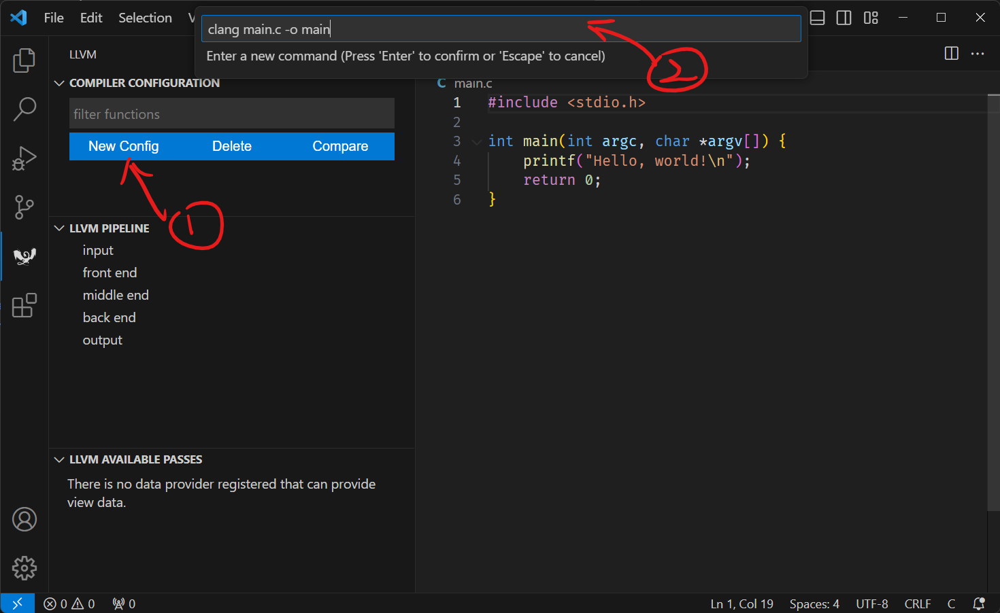
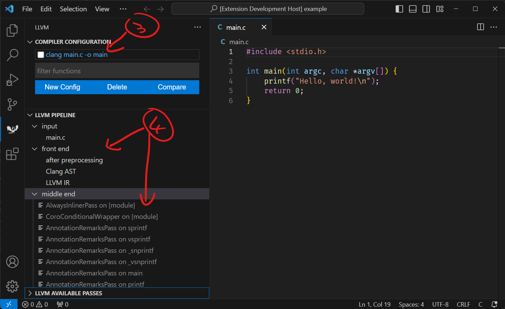
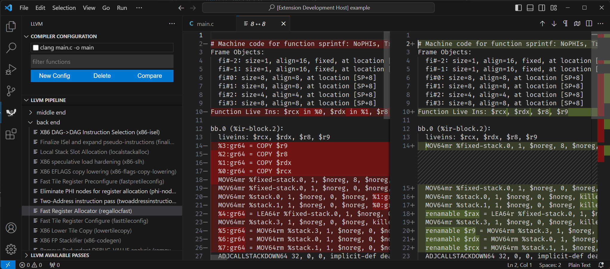
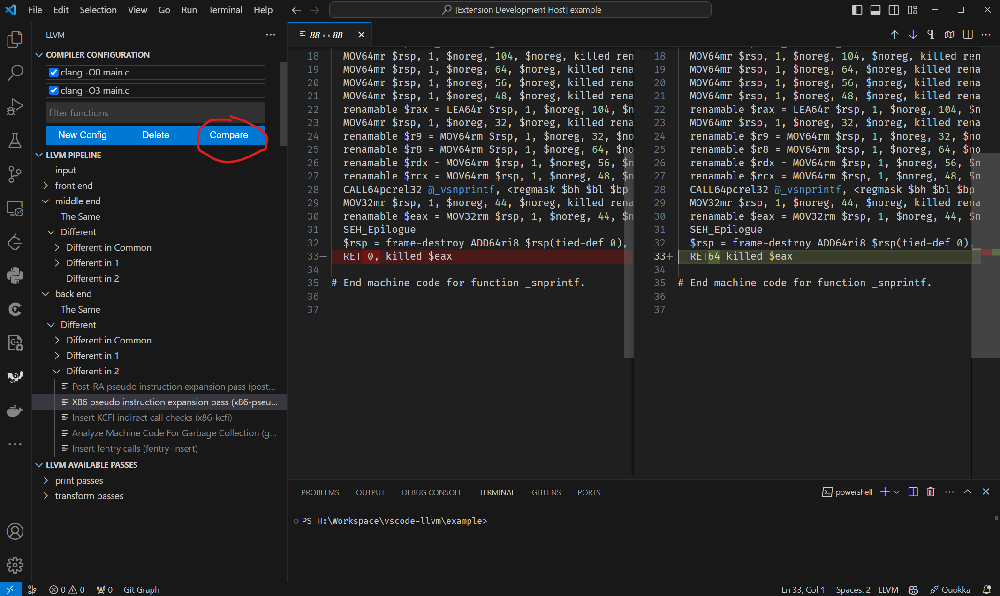
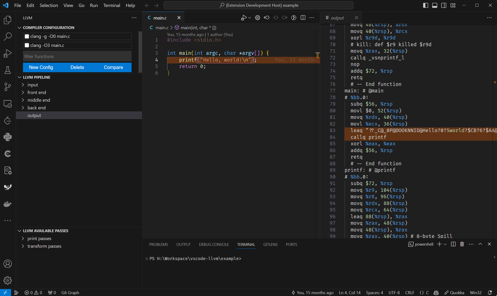

# VSCode LLVM Compiler Explorer
Download from [VSCode marketplace](https://marketplace.visualstudio.com/items?itemName=XiaofanSun.vscode-llvm).

This is a tool for compiler developers of LLVM. This vscode extension can support exploring LLVM IR and machine IR after each pass. 

## Features

1. Run a clang command and explore preprocessing phase, clang AST building phase, each phase of LLVM passes, and final generated assembly code.
2. Compare difference between IRs before and after running a pass.
3. Support custom clang or modified version.

## How to use

1. Click 'New config' for creating a new configuration
2. Type your command to compile the file

3. (Optional) If you want to focus on one function. You can type the function name in the 'filter function' field. Please note, this function name should be mangle name if it's C++. Then, click the command name to run the command.
4. Now, you can explore the IRs after each pass.

## Compare Mode

To debug a pass, you may want to compare a clang command with and without the pass. Or you want to debug a different version of clang with the stable version. This extension can help you to compare the difference between two IRs after each pass.

## Source2Asm Mapping View

Inspired by Compiler Explorer, this extension can highlight the mapping between source code and the assembly code.

## Syntax Highlighting

This plugin provides syntax highlighting for Clang AST and assembly language. You may need to install additional LLVM syntax highlighting plugins, there are some options:

[RReverser.llvm](https://marketplace.visualstudio.com/items?itemName=RReverser.llvm)
[colejcummins.llvm-syntax-highlighting](https://marketplace.visualstudio.com/items?itemName=colejcummins.llvm-syntax-highlighting)

